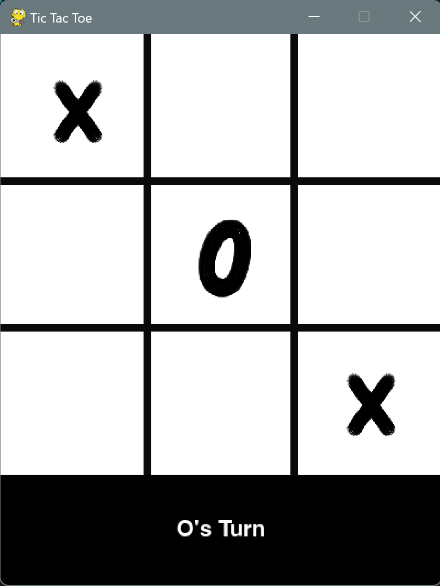
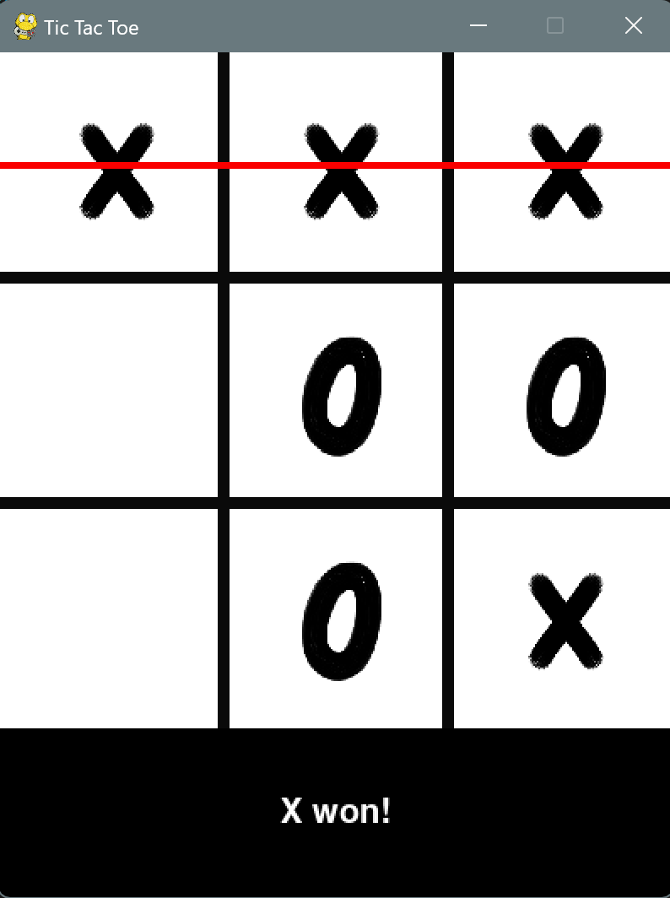

# Tic-Tac-Toe Game

Welcome to the Tic Tac Toe Game repository! This project is a modern implementation of the classic Tic Tac Toe game, built using Python and Pygame. It features a graphical interface with custom images for the X and O symbols, and provides a simple yet engaging way to play the game against another player on the same machine.

## Features

- **Graphical Interface:** The game includes a visually appealing interface with custom images for X and O.
- **Win Detection:** The game automatically detects wins and highlights the winning line.
- **Draw Detection:** The game detects when there is no possible winner and declares a draw.
- **Easy Reset:** The game automatically resets after a short delay when a win or draw occurs.
- **Sound Effects:** Enjoy sound effects during gameplay (Optional, add if sound is implemented).

## Screenshots

![Game Opening] (Screenshots/Tic Tac Toe_2.png)



## Getting Started

### Prerequisites

- Python 3.x
- Pygame

### Installation

1. Clone the repository:
    ```bash
    git clone https://github.com/anishkumarvedant/tic-tac-toe-game.git
    ```

2. Change into the project directory:
    ```bash
    cd tic-tac-toe-game
    ```

3. Install the required packages:
    ```bash
    pip install pygame
    ```

### Running the Game

To start the game, simply run the `tic_tac_toe.py` script:
```bash
python3 tic_tac_toe.py
```

### How to Play

The game opens with a splash screen and then displays the game board.Players take turns clicking on the grid to place their X or O.The game will automatically detect a win or draw and reset after displaying the result.

### Contributing

Contributions are welcome! Please fork the repository and create a pull request with your changes.

### License

This project is licensed under the MIT License.

### Acknowledgements

Thanks to the Pygame community for their excellent resources and tutorials.

### GitHub Repository Details

**Description:**  
A modern implementation of the classic Tic Tac Toe game built with Python and Pygame.

**Website:**  
*Enter a valid URL here, such as a personal portfolio or project page if available.*

**Topics:**  
python pygame game-development tic-tac-toe graphics interactive-game classic-game educational-project open-source

Feel free to customize the URL and any other information according to your preferences.
